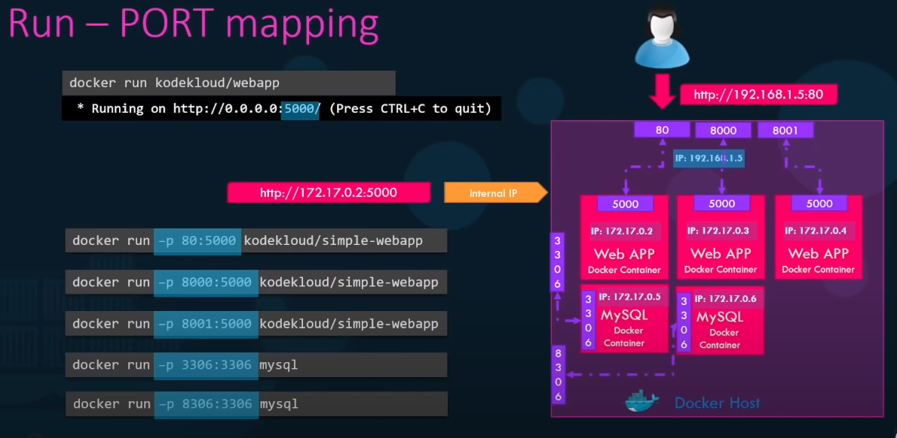

# 42Barcelona_ciber_Ft_onion
Serve a web page from a Tor network hidden service.

I would like to solve this challenge using Docker.
Selecting the right docker images is by them self a learning process.
Finally i worked with 3 different images. One for each server.

My approach wants to set up three Docker;

1.- nginx server. SSH connection allowed to inspect html files.

2.- Tor server.

3.- Python Dashboard server (This is the Bonus part).


---
# nginx config files

Nginx default listen port is 80.
I set up in the port 81 the static hidden service accessible thur tor.

## General setting: /etc/nginx.nginx.conf

Please read inside to learn how to secure it a bit more.

```
user  nginx;
worker_processes  auto;

error_log  /var/log/nginx/error.log notice;
pid        /var/run/nginx.pid;


events {
    worker_connections  1024;
}


http {
    include       /etc/nginx/mime.types;
    default_type  application/octet-stream;

    log_format  main  '$remote_addr - $remote_user [$time_local] "$request" '
                      '$status $body_bytes_sent "$http_referer" '
                      '"$http_user_agent" "$http_x_forwarded_for"';

    access_log  /var/log/nginx/access.log  main;

    sendfile        on;
    #tcp_nopush     on;

    keepalive_timeout  65;

    # if in the docker file uncomment this, helps to reduce hidden service footprint
    # when an outsider request the server to introdude himself.
    #RUN sed -i -e '/    keepalive_timeout  65;/a     server_tokens off;' nginx.conf

    #gzip  on;

    include /etc/nginx/conf.d/*.conf;
}
```
## 80 port server setting:  /etc/nginx/conf.d/default.conf

This is the configuration file used to render default service.

```
server {
    listen       80;
    listen  [::]:80;
    server_name  localhost;

    #access_log  /var/log/nginx/host.access.log  main;

    location / {
        root   /usr/share/nginx/html;
        index  index.html index.htm;
    }

    #error_page  404              /404.html;

    # redirect server error pages to the static page /50x.html
    #
    error_page   500 502 503 504  /50x.html;
    location = /50x.html {
        root   /usr/share/nginx/html;
    }
}
```


## 81 port server setting: /etc/nginx/conf.d/open.conf

This is the configuration file used to render de hidden service thru Tor.

Here is a point __for improvement__ changing 0.0.0.0 for the dark docker ip address.

With this i would restrict the ip the incoming request comes from.


```
server {
       # server ip #
       # only allows request comming to this address.
       listen 0.0.0.0:81;
       
       # virtual server name i.e. domain name #
       server_name www.open.net;

       # document root #
       root /var/www/open;
       index index_open.html;

       # log files
       access_log  /var/log/nginx/www.open.net_access.log;
       error_log   /var/log/nginx/www.open.net_error.log;

       # cache files on browser level #
       # Directives to send expires headers and turn off 404 error logging. #
       location ~* ^.+\.(ogg|ogv|svg|svgz|eot|otf|woff|mp4|ttf|rss|atom|jpg|jpeg|gif|png|ico|zip|tgz|gz|rar|bz2|doc|xls|exe|ppt|tar|mid|midi|wav|bmp|rtf)$ 
       {
       access_log off; log_not_found off; expires max;
       }
}

```


# Nginx Docker with static html page

Docker file will adapt it the image i will use in this challenge.

## Image build (22 MB)
Departure point is nginx:1.25.0-alpine-slim image.

you will see 3 sections in this docker file: one for __Nginx__, one for __ssh__ and one for __user creation__.

to start both services, the docker entry point is a sh script.

> /usr/sbin/nginx -g 'daemon off;' &
> ssh-keygen -A
> /usr/sbin/sshd -D -e "$@"

I suffered some headache here creating the user for the ssh service.
The problem is that rutinary i set a /bin/bash shell for the added User.
I was not aware that the alpine image comes with /bin/sh __only__.
This was constantly rejecting my ssh connection cause server could not set up the shell for the user.


[Suggestions to secure nginx reached from Tor](https://blog.0day.rocks/securing-a-web-hidden-service-89d935ba1c1d)
---
# Tor docker
## Image build (155 MB)

I installed tor in a docker debian:bookworm-slim image.

To do that:

1.- Defined Tor source in a tor.list file created/etc/apt/sources.list.d .

2.- Installed gpg, apt-transport-https, and wget to get keyrings.

3.- Installed tor deb.torproject.org-keyring.

4.- Removed gpg, apt-transport-https, and wget.

5.- Copied torrc file from my host to  docker /etc/tor folder.

6.- created hidden services folders and chmoed them to 700.

7.- init the service with ENTRYPOINT [ "/bin/tor" ].


## torrc configuration

The HiddenServicePort directive takes two arguments: 

* The port number to listen on.
* An optional IP address or hostname to bind to.

Following syntaxis I defined two hidden services:

> HiddenServiceDir /var/lib/tor/hidden_service_bonus/

> HiddenServicePort 80 data:84

and 

> HiddenServiceDir /var/lib/tor/hidden_service_static/

> HiddenServicePort 80 open:81

The former binds to a docker Python Dash Dash Board.
The Latter binds to a docker nginx with a static web page.

## uncover onion addresses

A bash script shows text addresses. 

> docker exec dark cat /var/lib/tor/hidden_service_bonus/hostname

You will see something like this ajrdqcz5sy4y4fwrdre754vro6jd57e425bzw2z6ei34u6ztkzxos5yd.onion

In this project each time you execute it a new onion address is created. Tor DOcker would have to have a docker volume to make some data persistent.

A python Script shows address's QR CODE

> python3 -m onion_qr


---
# Data Docker (Dynamic web page - Bonus)

## Image Build (735 MB)

I installed my Dashboard  in a docker python:3.7-slim .

Manually installed some dependencies:
dash, dash_bootstrap_components, numpy, pandas

Numpy links some C libraries non available in slim versions:

Must Install make, gcc, build-essential, dpkg-dev, libjpeg-dev.


• Fortificación SSH. Se evaluará concienzudamente durante la evaluación.


---
# Lessons
## Data Docker





Python package python depends on C libraries. 
No all Docker python images have tools to build Numpy python library

Alpine based images do not have. You must install missing building tools wiht APK add
Slim tagged images neither do have. you must install them using apt-get.

This is the reason why the Docker file for the Data Python Dash service Installs aditional packages
that are removed after Numpy Instalation.

Addicionally, Dash app.run_service has a host parameter dafaulted to 127.0.0.1. That default configuration did not worked for me. 
> app.run_server(debug=True, port=1234)

I changed it to 
> app.run_server(debug=True, host= IPAddr, port=1234)


onion_address = base32(PUBKEY | CHECKSUM | VERSION) + ".onion"
 CHECKSUM = H(".onion checksum" | PUBKEY | VERSION)[:2]

 where:
   - PUBKEY is the 32 bytes ed25519 master pubkey of the hidden service.
   - VERSION is an one byte version field (default value '\x03')
   - ".onion checksum" is a constant string
   - CHECKSUM is truncated to two bytes before inserting it in onion_address


   ## Dark Docker
   it is the container with TOR. 
   In the configuration files, i use a container name "data" that it is the container that show a Dashboard .
   Docekr internal DNS will solve the name.

